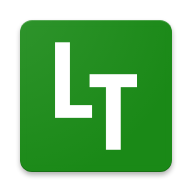

<h1 align="center">
  
</h1>

<h2 align="center">Tabela de Conteúdos</h2>

 <a href="#objetivo">Sobre</a> •
 <a href="#objetivo">Recursos</a> •
 <a href="#tecnologias">Tecnologias</a> • 
 <a href="#tecnologias">Status do Projeto</a> • 
 <a href="#autor">Autor</a>

<h2 align="center">Sobre</h2>

Um App para controle de tarefas a fazer, com ele você vai poder criar, editar, excluir uma tarefa, também vai poder marcar ou descarcar uma tarefa como concluída, e tbm vai ter um contador monstrando quantas tarefas você tem registradas no App, o objetivo o App, é ajudar a ter uma organização das tarefas diárias.

<h3 align="center">Recursos</h3>

- [x] Criar tarefa
- [x] Editar tarefa
- [x] Excluir tarefa
- [x] Marcar ou desmarcar tarefas como concluídas
- [x] Quantificar tarefas cadastradas no app

### 🛠 Tecnologias

As seguintes ferramentas foram usadas na construção do projeto

- [Node.js](https://nodejs.org/en/)
- [React](https://pt-br.reactjs.org/)
- [React Native](https://reactnative.dev/)
- [TypeScript](https://www.typescriptlang.org/)

<h2 align="center">Status do Projeto</h2>

<h4 align="center"> 
	🚧  React Native 🚀 Versão 1.0 Concluída.  🚧.
</h4>

## 🦸 Autor

<a href="https://github.com/JailsonSantos">
 
  
 <b>Jailson Santos</b></a> <a href="https://www.linkedin.com/in/jailson-santos-726395104/" title="Jailson Santos">🚀</a>
  

 

## 📝 Licença

Este projeto esta sobe a licença [MIT](./LICENSE).

Feito com ❤️ por Jailson Santos 👋🏽 [Entre em contato!](https://www.linkedin.com/in/jailson-santos-726395104/)
